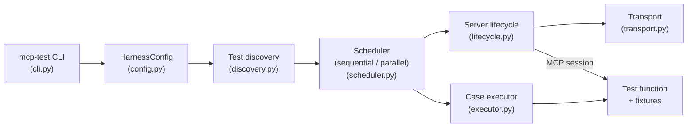
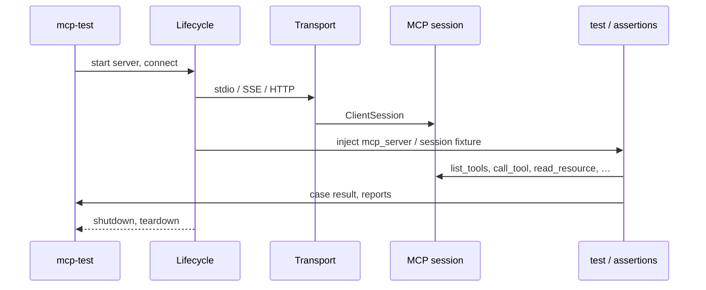

# Architecture (visual)

This page is a **one-screen mental model** of how MCP Test Harness runs: config → discovery → scheduling → per-case execution over a real MCP **session** (stdio, SSE, or streamable HTTP).

## End-to-end flow

- **One server per sequential run**, or **one server per worker** in parallel (tests from the same file stay on one worker; see [DECISIONS.md](DECISIONS.md)).
- **Schema checks** (optional) run right after connect via `scheduler` → [schema.py](../src/mcp_test_harness/schema.py).

## Data path (MCP)

## Where to go next

| Topic | Document |
|--------|----------|
| Config keys and CLI | [DEVELOPER_GUIDE.md](DEVELOPER_GUIDE.md) |
| Assert helpers and snapshots | [DEVELOPER_GUIDE.md](DEVELOPER_GUIDE.md) |
| Ecosystem (Inspector, conformance, evals) | [COMPARISON.md](COMPARISON.md) |
| Docker / OCI | [DOCKER.md](DOCKER.md) |
| **Editors (VS Code, Cursor)** | [EDITORS.md](EDITORS.md) |

**Related:** [IMPLEMENTATION_CHECKLIST.md](IMPLEMENTATION_CHECKLIST.md) maps features to **source files** for maintainers.
