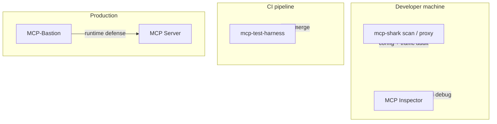

# Ecosystem: MCP Test Harness and related tools

MCP Test Harness is **deterministic, developer-written CI automation** over a real MCP client session. It does **not** require an LLM in the test loop.

Use **more than one tool** across the lifecycle: config security at dev time, server gates at merge time, Bastion at runtime.

## Comparison table

| Project | Primary focus | Typical use | vs Harness |
|--------|----------------|-------------|------------|
| **MCP Test Harness** (this repo) | Pytest-style CI: functional + regression + perf + security payloads | “Server passes our contract on every commit” | — |
| **[mcp-shark](https://github.com/mcp-shark/mcp-shark)** | IDE **config** security, toxic flows, live traffic forensics | “Is my Cursor/Windsurf MCP setup safe?” | **Complement** — config layer, not server CI |
| **MCP Inspector** | Manual GUI debugging | Local exploration | **Complement** — not CI |
| **MCP Conformance** | Protocol compliance suites | “Does our SDK match the spec?” | **Complement** — spec vs product regression |
| **mcp-eval** | Agent + LLM judges, OTel metrics | “Does an agent use our server well?” | **Adjacent** — stochastic, not merge gates |
| **testmcpy** | YAML + LLM tool-calling evals | Model comparison | **Adjacent** — LLM-in-loop |
| **MCPMark** | Model benchmarks on real services | Research / model quality | **Different question** |
| **Viper-MCP / mcp-testbench** | Stochastic fuzzing, crashes, injections | Find vulnerabilities | **Complement** — no SLO gates |
| **k6 / JMeter / Gatling** | Distributed HTTP load | Datacenter-scale RPS | **Complement** — no MCP lifecycle |
| **[MCP-Bastion](https://github.com/vaquarkhan/MCP-Bastion)** | Runtime WAF: injection, PII, rate limits | Production protection | **Pair** — test in CI, protect live |

Full positioning: [POSITIONING.md](POSITIONING.md).

## How tools fit together



| Question | Tool |
|----------|------|
| Is my **IDE config** risky? | mcp-shark |
| Does my **server** pass **our** tests? | MCP Test Harness |
| Is the implementation **spec-correct**? | MCP Conformance |
| How does an **LLM agent** behave? | mcp-eval, testmcpy |
| Is production **protected**? | MCP-Bastion |

## mcp-shark pairing (recommended)

[mcp-shark](https://github.com/mcp-shark/mcp-shark) scans **static IDE configs** (secrets, OWASP rules, toxic cross-server flows) and optionally captures **live JSON-RPC** via a local proxy. It does **not** replace server functional tests.

```yaml
# .github/workflows/mcp-quality.yml
jobs:
  config-security:
    runs-on: ubuntu-latest
    steps:
      - uses: actions/checkout@v4
      - run: npx @mcp-shark/mcp-shark scan --ci --format sarif
  server-tests:
    runs-on: ubuntu-latest
    steps:
      - uses: actions/checkout@v4
      - uses: vaquarkhan/mcp-test-harness/.github/actions/mcp-test@main
        with:
          server-command: "python -m my_server.mcp"
          test-directory: tests/
```

**License note:** mcp-shark uses a **non-commercial** license. Integrate via CLI sidecar in CI; do not embed its code or rule packs in this MIT project without permission.

## Postman / load testing

**Collections** (declarative YAML flows) are roadmap — see [COLLECTIONS.md](COLLECTIONS.md). Today: **Python** multi-step tests.

**Cluster-scale load** stays outside core; use k6/JMeter for extreme RPS. Harness owns **MCP-aware SLO gates** (`assert_latency`, `assert_throughput` with `min_rps`, `max_p99_ms`, `max_error_rate`).

## LLM test generation

Harness is for **deterministic** CI. External LLMs may **draft** tests with human review — see [LLM_TEST_GENERATION.md](LLM_TEST_GENERATION.md).

## Companion: MCP-Bastion

Bastion = **runtime security**. Harness = **test automation**. See root [README.md](../README.md#security-testing-with-mcp-bastion).
