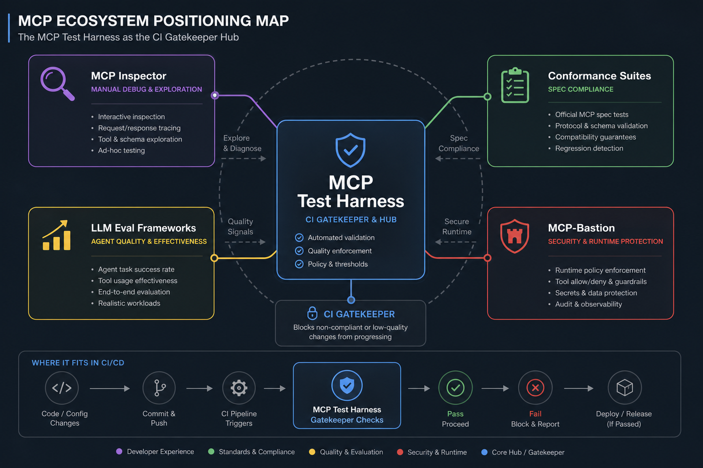
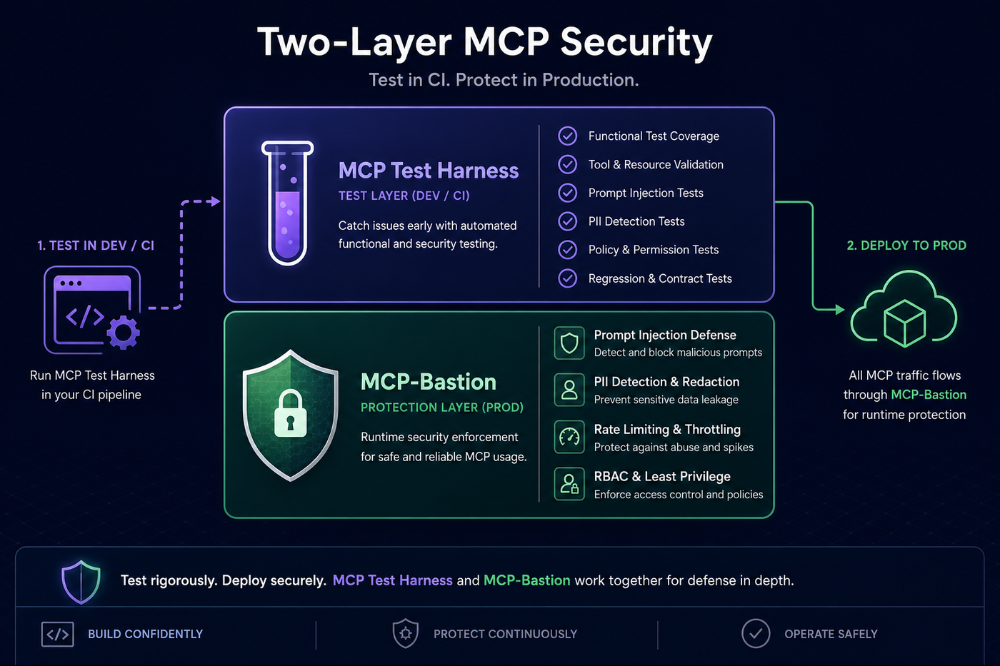
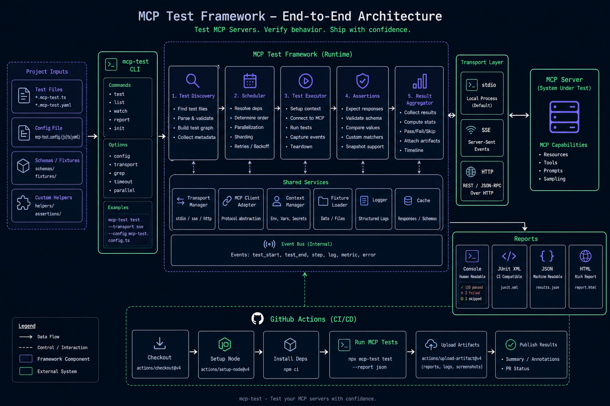
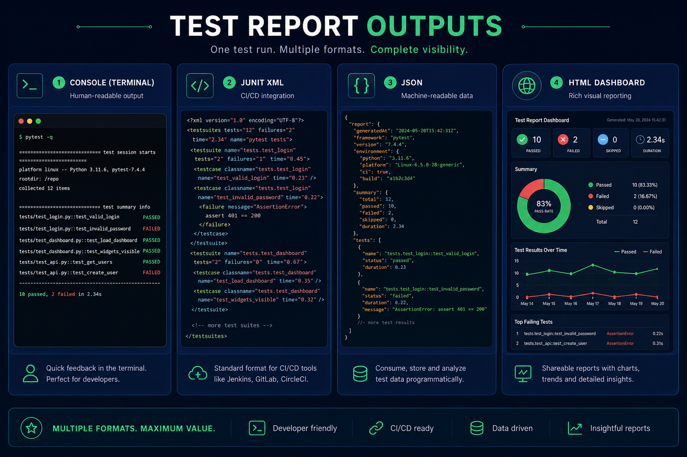

# Documentation handbook

**Version:** 4.0.0  
**Purpose:** Single entry point for the full system — concepts, security-first rationale, CI scan report, feature map, operate recipes, and companion references.  
**Published:** https://vaquarkhan.github.io/mcp-test-harness/guide/handbook.html  
**Source:** this file (`docs/HANDBOOK.md`)

> Prefer this handbook over stuffing the root README. The README stays a thin index; **this page is the handbook**.  
> Companion runtime handbook: [MCP-Bastion Documentation handbook](https://vaquarkhan.github.io/MCP-Bastion/guide/bible.html).

---

## Visual tour (start here)

### CI scan report (static HTML artifact)

Self-contained HTML from `mcp-test --report-format html`: sticky scan TOC, quality-gate scorecard, full OWASP/MCP findings table, MCP contract coverage %, portal scores. No hosted dashboard required.

Live sample: [html/reports/sample_mcp_test_report.html](../html/reports/sample_mcp_test_report.html) · strategy: [SECURITY_TESTING.md](SECURITY_TESTING.md) · CI notes: [CI_AND_REPORTS.md](CI_AND_REPORTS.md)

### Scan → Test → Enforce lifecycle

| Diagram | What it shows |
|---------|----------------|
|  | Position vs Inspector, conformance, evals, Bastion |
|  | Test defenses in CI; enforce at runtime |
|  | CLI → MCP server → assertions → reports |
|  | PR gate with JUnit / SARIF / HTML artifacts |
|  | Console, JUnit, JSON, HTML, SARIF, PR summary |

### Architecture at a glance

```text
Developer / CI
      │  mcp-test
      ▼
┌────────────────────────────┐
│  MCP Test Harness          │  deterministic CI gate
│  fixtures · assertions     │  functional / regression / perf / security
│  quality_gate · manifest   │  SARIF + HTML scan report
└─────────────┬──────────────┘
              ▼
        Your MCP server
              │
              ▼  (production path — separate product)
┌────────────────────────────┐
│  MCP-Bastion               │  runtime allow / block / redact / observe
└────────────────────────────┘
```

---

## How to use this handbook

| You want… | Go to |
|-----------|--------|
| Install & first green run | [QUICK_START.md](QUICK_START.md) · [TUTORIAL.md](TUTORIAL.md) |
| Why security-first (this handbook) | [Part 2](#part-2--why-security-first) below |
| Security payloads, quality gate, manifest rug-pull | [SECURITY_TESTING.md](SECURITY_TESTING.md) |
| Full API / config / assertions | [DEVELOPER_GUIDE.md](DEVELOPER_GUIDE.md) |
| Stateless SEP-2575 | [TUTORIAL_STATELESS.md](TUTORIAL_STATELESS.md) · [RFC-006](design/RFC-006-stateless-mcp.md) |
| Ecosystem map (Inspector, mcp-scan, Bastion) | [COMPARISON.md](COMPARISON.md) · [POSITIONING.md](POSITIONING.md) |
| Moat roadmap (deterministic only) | [ROADMAP.md](ROADMAP.md) |
| CRA / SBOM evidence | [CRA_COMPLIANCE.md](CRA_COMPLIANCE.md) |
| Runtime enforce (companion) | [MCP-Bastion handbook](https://vaquarkhan.github.io/MCP-Bastion/guide/bible.html) |

**Repos:** MCP Test Harness = **CI test gate** (`mcp-test-harness`).  
**MCP-Bastion** = runtime **security engine** (`mcp-bastion-python`). They pair; they do not replace each other.

---

## Part 1 — What the harness is

MCP Test Harness is a **pytest-style, MCP-aware test framework** for Model Context Protocol servers. It is **deterministic by default**, **CI-native**, and **code-first** — no LLM judge in the loop.

| Property | Choice |
|----------|--------|
| Nature | Deterministic, reproducible, MCP-specific |
| Transports | stdio / SSE / HTTP (incl. stateless SEP-2575) |
| Modes | Functional · regression · performance · security · resiliency |
| Reports | Console · JUnit · JSON · HTML scan · SARIF · PR summary · CRA matrix |
| Defaults | Safe; `quality_gate` / `manifest_gate` are **opt-in** |
| Infra | Zero hosted dashboard — artifacts are files |

It proves *your MCP server* is correct, fast enough, and hardened enough for merge — not that a particular model answers well.

---

## Part 2 — Why security-first

Agentic systems turn MCP tools into **programmable privilege**. A single compromised tool description, missing auth boundary, or silent schema change can move data, mutate systems, or burn budget — often without a human in the loop.

### Why “test later” fails for MCP

| Reality | Risk if you wait |
|---------|------------------|
| Tools are callable by models | Prompt injection and confused-deputy abuse |
| Schemas + descriptions are the API | Rug-pull / supply-chain drift after merge |
| Agents retry and fan out | Latency and error rate become outages |
| Secrets appear in tool I/O | Leakage into logs, traces, and model context |
| Spec revisions land frequently | Silent protocol breakage across clients |

Security-first here means: **fail the PR when behavioral defenses or the sanctioned surface regress** — before production traffic hits Bastion.

### What the harness owns (CI)

- Auth boundaries (`assert_tool_denied`, `assert_authorization_boundary`)
- Payload packs (injection, path traversal, secret leak, Suite A semantic egress + known covert encodings)
- Capability-reduction check (`assert_general_exec_tools_absent`) for forbidden shell/exec tools
- OWASP-MCP / OWASP-LLM rule metadata on findings (SARIF + HTML scan)
- Opt-in `quality_gate:` (require security tests, fail on severity)
- Opt-in `manifest_gate:` (merge-time rug-pull / supply-chain baseline)
- Contract coverage map (advertised vs tested tools/resources/prompts)

### What Bastion owns (runtime)

See the [Bastion handbook](https://vaquarkhan.github.io/MCP-Bastion/guide/bible.html): prompt guard, PII vault/redaction, rate/cost, RBAC, schema validation, replay, proxy boundary, local dashboard.

```text
Scan / config (mcp-shark, Bastion scan)
        →  Test / CI gate (this harness)
        →  Enforce / runtime (MCP-Bastion)
```

Skipping the middle step is how teams ship green dashboards and still get surprised in production.

---

## Part 3 — CI scan report (Sonar-like, still CI-native)

The HTML report is a **static scan artifact**, not a multi-tenant SaaS product.

| Panel | Why it exists |
|-------|----------------|
| Sticky Scan TOC | Jump Gate → Security → Coverage → Results |
| Scan overview cards | Gate status, findings, contract %, manifest, flaky |
| Quality gate scorecard | Policy knobs + reasons + severity histogram |
| Security findings table | Full OWASP/MCP rows (sev, rule, file, help) |
| Contract coverage | % ring + untested / missing-auth issues |
| Unified portal | Functional / perf / security / resiliency scores |
| Bastion pairing | CI verifies ↔ runtime enforces |

```bash
mcp-test --report-format html --report-output report.html
mcp-test --sarif-output findings.sarif
mcp-test --pr-summary-output mcp-pr-summary.md
```

Config sketch:

```yaml
# mcp-test.yaml
quality_gate:
  require_security_tests: true
  fail_on_severity: high
manifest_gate:
  enabled: true
  path: __snapshots__/mcp_manifest.snap
```

Deep dive: [SECURITY_TESTING.md](SECURITY_TESTING.md) · [CI_AND_REPORTS.md](CI_AND_REPORTS.md)

---

## Part 4 — Feature map

| Family | Examples |
|--------|----------|
| Protocol fixtures | `mcp_server`, `mcp_server_session`, lifecycle + schema validation |
| Correctness | `assert_tool_call`, `assert_resource_read`, `assert_prompt`, `assert_capabilities` |
| Regression | `assert_snapshot`, `assert_tool_idempotent`, manifest snapshot |
| Performance | `assert_latency`, `assert_throughput`, `assert_stateless_throughput`, baselines |
| Security | payload packs (injection, path, leak, Suite A egress/covert, exec capability reduction), auth boundaries, SARIF, quality_gate, OWASP rules |
| Resiliency | `assert_reconnects`, experiments catalog (`mcp-test experiment`) |
| Chaos | protocol-aware faults (`chaos.py`) |
| Coverage | advertised vs tested inventory + gaps |
| Conformance | `mcp-test try`, RFC-002 levels, RFC-006 stateless |
| Productivity | `mcp-test init`, `generate`, `record`, `doctor`, pre-commit hooks |
| Moat (Tier 1) | manifest rug-pull gate · history/trends (next) · flakiness · version matrix |

Scope guardrails (what we **do not** build): LLM playground / model-vs-model scoring; always-on hosted dashboard; out-scanning mcp-scan on general threat intel; datacenter-scale generic load farms. Details: [ROADMAP.md](ROADMAP.md).

---

## Part 5 — Operate

| Task | Command / doc |
|------|----------------|
| Scaffold | `mcp-test init` · [QUICK_START.md](QUICK_START.md) |
| Run suite | `mcp-test` / `mcp-test -m security` |
| Manifest check | `mcp-test manifest check` / `update` / `show` |
| Zero-config probe | `mcp-test try` · `mcp-test doctor` |
| Stateless certify | `mcp-test conformance stateless --url …` |
| HTML + SARIF | `--report-format html` · `--sarif-output` |
| CRA matrix | `--cra-output reports/cra_conformity_matrix.json` |
| Docker | `docker run --rm ghcr.io/vaquarkhan/mcp-test-harness:latest --version` · [DOCKER.md](DOCKER.md) |
| Release | tag `vX.Y.Z` · [RELEASING.md](RELEASING.md) |

---

## Part 6 — Learning paths

1. **Developer (30 min):** [QUICK_START](QUICK_START.md) → feature demo packs → one HTML report locally  
2. **Security reviewer:** Part 2 → [SECURITY_TESTING](SECURITY_TESTING.md) → enable `quality_gate` + `manifest_gate` → SARIF in Code Scanning → [Bastion handbook](https://vaquarkhan.github.io/MCP-Bastion/guide/bible.html) for runtime  
3. **Platform / perf:** [PERFORMANCE](PERFORMANCE.md) → baselines → RFC-006 stateless  
4. **Compliance:** [CRA_COMPLIANCE](CRA_COMPLIANCE.md) → [ENTERPRISE_GOVERNANCE](ENTERPRISE_GOVERNANCE.md) → evidence packs  

---

## Asset index

| Asset | Path |
|-------|------|
| Feature overview | `docs/images/mcp-testobarness-feature.png` |
| Ecosystem map | `docs/images/ecosystem-map.png` |
| Harness ↔ Bastion | `docs/images/harness-bastion-pairing.png` |
| End-to-end flow | `docs/images/end-to-end-flow.png` |
| CI pipeline | `docs/images/ci-pipeline.png` |
| HTML dashboard / scan | `docs/images/html-dashboard.png` |
| Sample HTML report | `html/reports/sample_mcp_test_report.html` |
| Site copies | `html/assets/images/` |

---

## Related published pages

### This project

- https://vaquarkhan.github.io/mcp-test-harness/guide/ (docs hub)
- https://vaquarkhan.github.io/mcp-test-harness/guide/handbook.html
- https://vaquarkhan.github.io/mcp-test-harness/guide/getting-started.html
- https://vaquarkhan.github.io/mcp-test-harness/guide/security.html
- https://vaquarkhan.github.io/mcp-test-harness/guide/reports.html
- https://vaquarkhan.github.io/mcp-test-harness/
- https://vaquarkhan.github.io/mcp-test-harness/compare.html
- https://vaquarkhan.github.io/mcp-test-harness/examples.html
- https://vaquarkhan.github.io/mcp-test-harness/reports/sample_mcp_test_report.html
- https://github.com/vaquarkhan/mcp-test-harness
- https://pypi.org/project/mcp-test-harness/

### Companion & references (end)

| Reference | Why it matters |
|-----------|----------------|
| [MCP-Bastion Documentation handbook](https://vaquarkhan.github.io/MCP-Bastion/guide/bible.html) | Canonical runtime security handbook — attack→defense, dashboard, pillars |
| [MCP-Bastion](https://github.com/vaquarkhan/MCP-Bastion) | Enforce in production what CI verified |
| [Bastion attack demos](https://vaquarkhan.github.io/MCP-Bastion/guide/attack-demos.html) | Runnable ATTACK → BLOCK/REDACT stories |
| [Bastion feature deep dive](https://vaquarkhan.github.io/MCP-Bastion/guide/feature-deep-dive.html) | Issue → control → benefit for every pillar |
| [mcp-shark](https://github.com/mcp-shark/mcp-shark) | IDE / config-time MCP security scanning |
| [OWASP Top 10 for LLM Applications](https://owasp.org/www-project-top-10-for-large-language-model-applications/) | Shared taxonomy for findings (`OWASP-LLM`) |
| [Model Context Protocol](https://modelcontextprotocol.io/) | Protocol specification the harness exercises |
| [EU Cyber Resilience Act (overview)](https://digital-strategy.ec.europa.eu/en/policies/cyber-resilience-act) | CRA evidence packaging context · see [CRA_COMPLIANCE.md](CRA_COMPLIANCE.md) |
| [SARIF standard](https://docs.oasis-open.org/sarif/sarif/v2.1.0/sarif-v2.1.0.html) | GitHub Code Scanning upload format |
| In-repo comparison | [COMPARISON.md](COMPARISON.md) · [POSITIONING.md](POSITIONING.md) |

---

MCP Test Harness 4.0.1 · MIT License · Author: Vaquar Khan  
Website · [Source markdown](https://github.com/vaquarkhan/mcp-test-harness/blob/main/docs/HANDBOOK.md)
